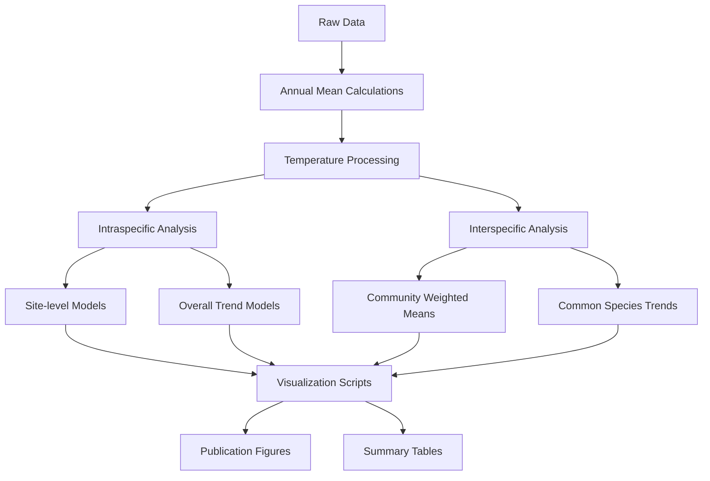

# BOSCH: Body sizes of aquatic macroinvertebrates from the Rhine-Main-Observatory

[](https://doi.org/10.1002/oik.11596)
[](https://www.r-project.org/)
[](https://www.gnu.org/licenses/gpl-3.0)

## Overview

This repository contains data and R code for analyzing long-term changes in macroinvertebrate body sizes from the Rhine-Main-Observatory (RMO) in central Germany. The study investigates both intraspecific and interspecific trends in body size over two decades (2001-2019) in response to environmental change, particularly temperature.

**Publication:** Mittag, D.C., Baker, N.J., Antão, L.H., Kuczynski, L., Haase, P., Welti, E.A.R. (2025). Increases in interspecific but mixed trends in intraspecific body sizes in German stream macroinvertebrates across two decades. *Oikos*, DOI: [10.1002/oik.11596](https://doi.org/10.1002/oik.11596)

## Study Summary

This study examines long-term changes in freshwater macroinvertebrate body sizes using a 20-year dataset from four stream sites in the Rhine-Main-Observatory, central Germany (2001-2019). The research addresses how climate change, particularly warming temperatures, affects both individual species (intraspecific) and community-level (interspecific) body size patterns.

**Study design:**
- **Sites:** Four streams representing a land-use gradient from headwater (Aubach, Bieber) to more impacted sites (Kinzig O3, W1)
- **Sampling:** Biannual sampling (spring/summer) following European Water Framework Directive protocols
- **Data:** 3,427 measured individuals from nine focal species across four taxonomic classes
- **Analysis:** Mixed-effects models examining temporal trends and temperature relationships

## Getting Started

### Download and Setup

To reproduce the analyses in this study:

1. **Download the repository:** Download the `BOSCH_scripts_and_data.zip` file
2. **Extract files:** Unzip the downloaded file to your desired location
3. **Set working directory:** Open the `BOSCH.Rproj` file in RStudio or set your R working directory to the extracted BOSCH folder
4. **Install dependencies:** Run the package installation code provided in the Dependencies section below

Once extracted, you will have access to all data files, R scripts, and resources needed to rerun the complete analysis pipeline.

## Repository Structure

```
BOSCH/
├── README.md
├── LICENSE
├── .gitignore
├── .Rhistory
├── BOSCH.Rproj
├── RawData/                          # Original input data
│   ├── IntraSppBS_updatedR1.csv     # Intraspecific body size measurements
│   ├── RMO4sites_updatedR1.csv      # Main community data from four sites
│   ├── Master_document_size_to_biomass_calculations.xlsx
│   ├── OtherEnvironmentalData/
│   └── Temp_data/
├── output_data/                     # Processed data and model results
│   ├── BioData_linkedto_TempData_updatedR1.csv
│   ├── CWM.csv                      # Community Weighted Mean calculations
│   └── IntraSpp_ModelOutputs/       # Intraspecific model results
│       ├── SiteLevel/
│       │   ├── TemperatureModels/
│       │   └── YearModels/
│       ├── TemperatureModels/
│       └── YearModels/
├── R/                               # Analysis scripts
│   ├── YrlyMeanCalculations_updatedR1.R
│   ├── IntraSppBodySizes.R
│   ├── InterSppBodySizes.R
│   ├── Add_silhouette_function.R
│   └── plotCode/
│       └── IntraSppSizes/
├── plots/                           # Generated figures and tables
│   ├── CWM_overYrandTemp.tiff
│   ├── Year_BL_wSilhouettes.tiff
│   └── Tables_T1-T8.xlsx
├── Silhouettes/                     # Custom invertebrate silhouette images
└── Invert_silhouettes/              # Species-specific silhouette files (SVG format)
```

## Data Description

### Study Sites and Sampling
- **Sites:** Four streams in central Germany representing a land-use gradient
  - *Headwater sites:* Aubach (reference site), Bieber (upstream area < 50 km²)  
  - *Larger sites:* Kinzig O3, Kinzig W1 (upstream areas 700-900 km²)
- **Time period:** 2001-2019 (Aubach, Bieber), 2005-2019 (Kinzig sites)
- **Sampling frequency:** Biannual (spring: March/April, summer: June/July)
- **Method:** European Water Framework Directive standardized multi-habitat sampling (20 sub-samples per 100m stream section)
- **Sample size:** 3,427 measured individuals from nine focal species

### Focal Species (Nine Taxa)
Selected for ubiquitous presence and taxonomic diversity across four classes:
- **Ephemeroptera:** *Ephemera danica* (n=848), *Baetis rhodani* (n=643)
- **Trichoptera:** *Hydropsyche siltalai* (n=390)  
- **Diptera:** *Prodiamesa olivacea* (n=510)
- **Hemiptera:** *Aphelocheirus aestivalis* (n=320)
- **Coleoptera:** *Orectochilus villosus* (n=94)
- **Gastropoda:** *Ancylus fluviatilis* (n=281)
- **Annelida:** *Eiseniella tetraeda* (n=135)
- **Gammaridae:** *Gammarus roeselii* (n=206)

### Data Types
- **Intraspecific body size data:** Direct measurements of body dimensions for nine common species
- **Interspecific community data:** Community composition and abundance for 223 taxa
### Temperature Data
- **Source:** High-resolution (1 km) CHELSA V2.1 climatic dataset (2000-2019)
- **Processing:** Mean annual air temperature calculated from 12 months prior to each sampling date
- **Validation:** Air temperature strongly correlated with stream temperature (r = 0.748, p < 0.001)
- **Interpolation:** Stream temperature gaps filled using chillR package (gaps < 2% of time series only)
- **Trait data:** Size-biomass conversion equations and trait information from freshwaterecology.info

### Body Size Metrics
- **Standard measurements:** Head width and total body length (10 individuals per sample when available)
- **Species-specific measurements:**
  - *Ancylus fluviatilis:* Shell length, width, height
  - *Eiseniella tetraeda:* Body length and width  
  - *Gammarus roeselii:* Body length and first antennae length
- **Measurement precision:** 0.01 mm using microscope and calipers
- **Conversion to biomass:** Length-mass relationships from published equations, primarily Benke et al. (1999)
- **Interspecific data:** Trait data from DISPERSE database (freshwaterecology.info) for 223 taxa

## Dependencies

### Required R Version
- R ≥ 4.2.2

### Required R Packages
```r
# Data manipulation and analysis
library(data.table)
library(tidyverse)
library(dplyr)
library(tidyr)
library(stringr)

# Statistical modeling
library(lme4)       # Linear mixed-effects models
library(nlme)       # Nonlinear mixed-effects models
library(car)        # Companion to Applied Regression
library(effects)    # Effect displays for linear models
library(MuMIn)      # Multi-Model Inference

# Visualization
library(scales)     # Scale functions for visualization
library(plotrix)    # Various plotting functions

# Specialized packages
library(chillR)     # Climate data processing
```

## Analysis Workflow

### Step 1: Data Preparation
```r
# Calculate annual means from raw data
source("R/YrlyMeanCalculations_updatedR1.R")

# Process temperature data
source("R/TempInterpolation.R")
```

### Step 2: Statistical Analysis
Run the following scripts in order:

```r
# Intraspecific body size analyses
source("R/IntraSppBodySizes.R")
source("R/IntraSppBodySizes_SiteLevelModels.R")

# Interspecific community analyses  
source("R/InterSppBodySizes.R")
source("R/Common_spp_trends.R")
source("R/Measured_9_spp_trends.R")
```

### Step 3: Visualization
```r
# Load silhouette function (required for all plotting scripts)
source("R/Add_silhouette_function.R")

# Generate main figures
source("R/plotCode/Temperature_figure_updatedR1.R")
source("R/plotCode/InterSppBodySizes_CWMplot_updatedR1.R")
source("R/plotCode/NineSpp_densities.R")

# Generate intraspecific plots (all use custom silhouettes)
source("R/plotCode/IntraSppSizes/Intra_BLtemp_plot.R")
source("R/plotCode/IntraSppSizes/Intra_BLyr_plot.R")
# ... (run all scripts in IntraSppSizes/ folder)
```

## Key Features

### Custom Visualization System
This repository includes a **custom silhouette plotting function** (`Add_silhouette_function.R`) that enhances scientific figures by adding organism silhouettes to plots. The function automatically retrieves species-specific silhouettes from the `Silhouettes/` folder to create publication-quality figures that visually represent the focal taxa alongside statistical results.

**Silhouette integration:**
- Species-specific invertebrate silhouettes for all nine focal taxa
- Automated placement and scaling within plots
- Consistent visual representation across all figures
- Publication-ready formatting for scientific journals

All visualizations use **R base plotting** (not ggplot2) to maintain consistency with the original analytical approach.

### Intraspecific Analysis
- **Objective:** Examine temporal trends in body size within the nine focal species
- **Statistical approach:** Generalized linear mixed models (GLMMs) using lme4::lmer
- **Response variables:** Body size (dry mass converted from length measurements)
- **Fixed effects:** 
  - Year (temporal trends) OR mean annual temperature (climate response)
  - Julian date (second-degree polynomial for seasonality)
  - Intraspecific density (density dependence)
- **Random effects:** Sampling site (accounts for repeated sampling)
- **Sample selection:** Up to 10 individuals per sample, measured haphazardly

### Interspecific Analysis  
- **Objective:** Examine community-level changes in body size structure
- **Method:** Community Weighted Mean (CWM) analysis using species densities
- **Data source:** 223 taxa with trait data from freshwaterecology.info DISPERSE database
- **Body size assignment:** Fuzzy-coded length bins converted to point estimates, weighted means for multi-bin taxa
- **Statistical models:** 
  - Overall trends: Mixed models with site as random effect
  - Site-specific trends: Linear regression with Julian date
- **Density analysis:** Trends for 59 species present in ≥12 sampling years per site

### Statistical Approach
- Mixed-effects models account for repeated sampling at sites
- Model selection using AIC and likelihood ratio tests
- Effect sizes and confidence intervals reported
- Temperature relationships examined using interpolated daily temperature data

## Key Outputs

### Figures
- **Temperature trends:** Time series of temperature changes across sites
- **Intraspecific trends:** Species-specific body size changes over time and temperature
- **Community trends:** Community Weighted Mean body size changes
- **Density trends:** Population density changes for focal species

### Tables
- **Summary statistics:** Descriptive statistics for all measured variables
- **Model results:** Statistical model outputs and effect sizes
- **Species information:** Taxonomic and trait information for focal species

## Flow Diagram



## Troubleshooting

### Common Issues

**Error: Package not found**
- Install missing packages using `install.packages("package_name")`
- Ensure all dependencies are installed before running analyses

**Error: File not found**
- Check that working directory is set to the repository root
- Ensure all data files are present in the RawData folder
- Verify file paths in scripts match your directory structure

**Memory issues with large datasets**
- Increase R memory limit if working with large datasets
- Consider running analyses on subsets if memory is limited

**Plotting errors**
- Ensure silhouette files are present in the Silhouettes folder
- Check that Add_silhouette_function.R has been sourced before plotting
- Verify that all required plotting packages are installed

### Data Requirements

**Minimum data requirements:**
- Community abundance data by site, date, and taxon
- Body size measurements for focal species
- Environmental data (especially temperature)
- Size-to-biomass conversion factors

**File format requirements:**
- CSV files should use comma delimiters
- Excel files should be readable by standard R packages
- Date formats should be consistent across all files

## Contact Information

**Lead Author:** Ellen A. R. Welti  
**Corresponding Author:** [Contact information to be added]

**Repository Maintainer:** [Your contact information]

For questions about the analysis, data, or code, please:
1. Check the troubleshooting section above
2. Create an issue on this GitHub repository
3. Contact the repository maintainer

## Citation

If you use this code or data in your research, please cite:

Mittag, D.C., Baker, N.J., Antão, L.H., Kuczynski, L., Haase, P., Welti, E.A.R. (2025). Increases in interspecific but mixed trends in intraspecific body sizes in German stream macroinvertebrates across two decades. *Oikos*, DOI: 10.1002/oik.11596

## Acknowledgments

- LTER Site: Rhine-Main-Observatory for long-term data collection (https://deims.org/9f9ba137-342d-4813-ae58-a60911c3abc1)

---

*Repository created: [Date]*  
*Last updated: August 2025*